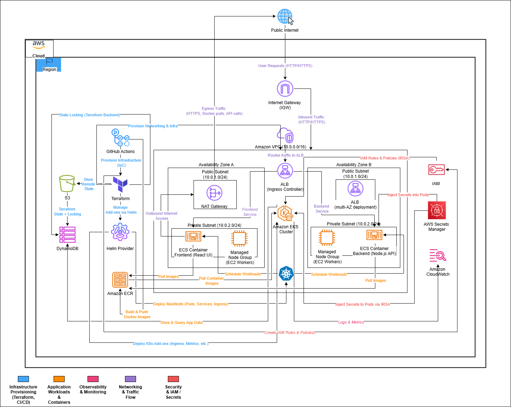
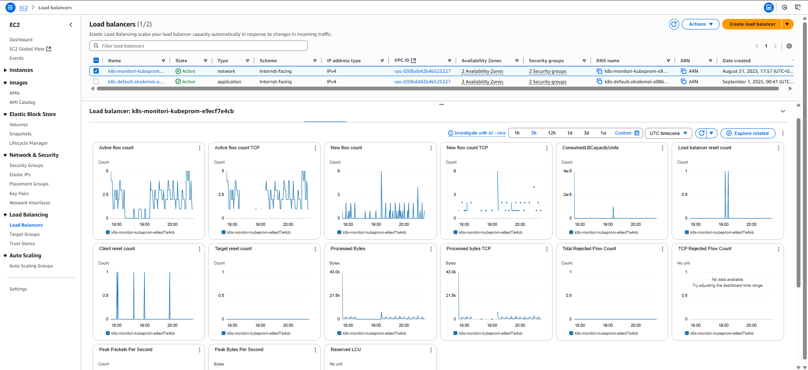
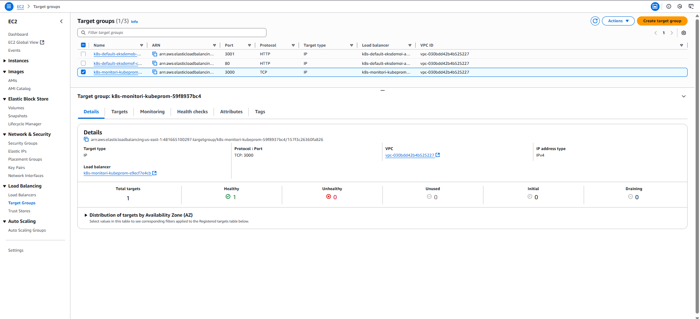
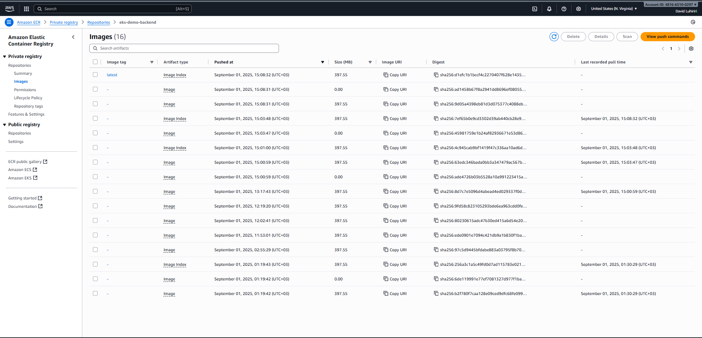
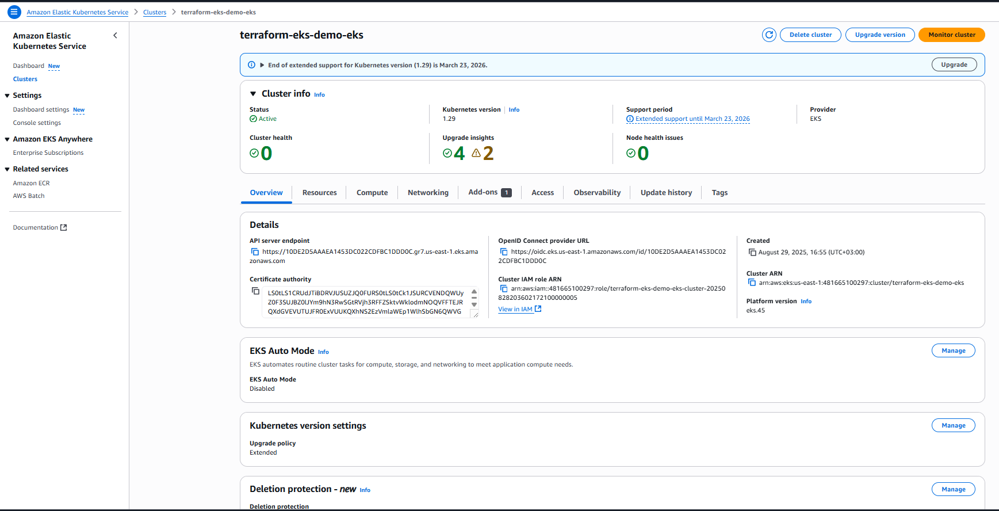
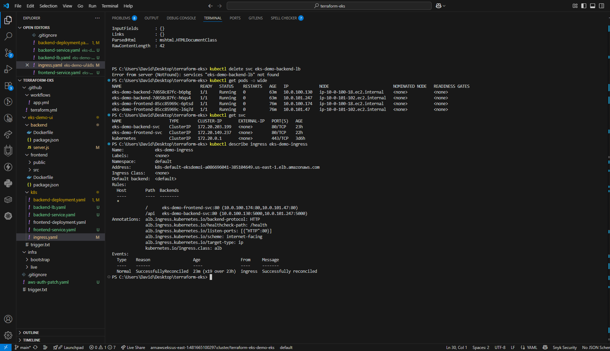
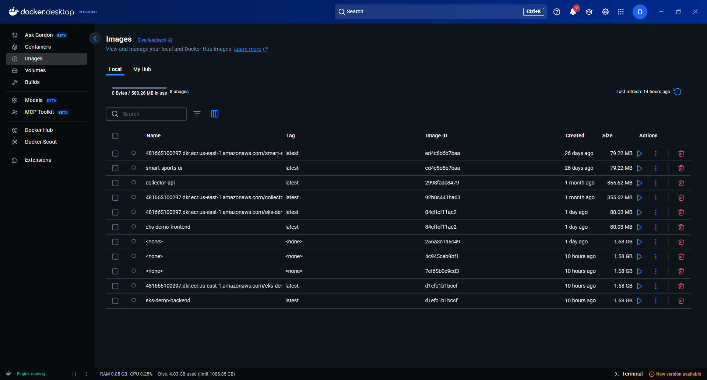
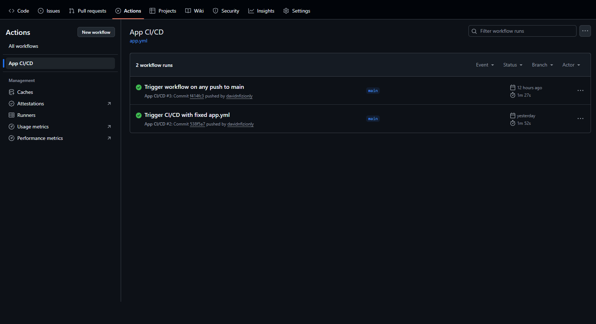

#  Terraform-Powered Kubernetes Cluster – EKS Deployment with Demo App

Production-ready Kubernetes cluster on AWS, fully provisioned via Terraform, with a demo full-stack app and CI/CD pipeline.


---


##  30-Second Overview
- 🏗️ **Infrastructure as Code** – Complete AWS infra (VPC, IAM, EKS) automated via Terraform  
-  **Production-Grade Kubernetes** – Managed node groups, secure IAM (IRSA), and scaling  
-  **Demo Application** – React frontend + Node.js backend deployed with Helm via Terraform  
-  **Security Built-in** – IAM roles, Secrets Manager, private networking  
-  **CI/CD Integrated** – GitHub Actions automates infra + app delivery  
-  **Observability** – CloudWatch Container Insights for logs & metrics  

---

##  Project Overview
This project provisions a **production-ready Kubernetes cluster** on **Amazon EKS** using **Terraform (IaC)**.  
It includes a **demo full-stack application** (Node.js API + React UI) exposed via an **Application Load Balancer (ALB)** using the AWS ALB Ingress Controller.  

The setup demonstrates:  
- **Infrastructure automation** with Terraform  
- **Kubernetes orchestration** with EKS  
- **Secure IAM** design (IRSA + Secrets Manager)  
- **CI/CD pipelines** with GitHub Actions for both infra & app  
- **Scalability and observability** (auto-scaling pods + CloudWatch Container Insights)  

---

##  Key Business Outcomes
- **IaC at scale** – Terraform-managed infra, repeatable & version-controlled  
- **Full-stack deployment** – Backend + frontend containerized & deployed on K8s  
- **Zero downtime delivery** – CI/CD pipeline with GitHub Actions  
- **Enterprise security** – IRSA + Secrets Manager for least-privilege access  
- **Scalable & monitored** – Pods auto-scale under load, CloudWatch metrics  

---

##  Architecture Diagram

**

---

##  Pipeline Design Philosophy
Workflow:  
📜 Terraform (IaC) → 🏗️ AWS Infra (VPC, EKS, IAM) → ⚙️ Helm/Terraform Manifests → 🚀 App Deploy (frontend/backend) → 🌐 ALB Ingress → 📊 Monitoring & CI/CD  

Highlights:  
- **Event-Driven IaC** – Every infra/app change = GitHub Actions trigger  
- **Immutable infra** – Declarative Terraform ensures consistency  
- **Modular** – Separate Terraform modules for VPC, EKS, IAM, and apps  
- **Fault Tolerant** – Auto-healing nodes, pod rescheduling  
- **Secure by default** – IRSA + OIDC auth for GitHub Actions  

---

##  Technology Stack & AWS Services

| Category | AWS Service / Tool | Purpose |
|----------|--------------------|---------|
| IaC | Terraform | Provision all infra (VPC, IAM, EKS, Helm) |
| Container Orchestration | Amazon EKS | Managed Kubernetes cluster |
| Networking | Amazon VPC | Isolated networking with subnets + NAT GW |
| Container Registry | Amazon ECR | Store app images (frontend/backend) |
| Compute | Managed Node Groups | Auto-scaled worker nodes |
| Ingress | ALB Ingress Controller | Publicly expose apps |
| CI/CD | GitHub Actions | Automate infra & app delivery |
| Secrets | AWS Secrets Manager | Secure API keys/configs |
| Observability | CloudWatch | Logs & metrics (Container Insights) |

---

##  Development Stack

| Component | Technology | Purpose |
|-----------|------------|---------|
| Infra | Terraform | IaC provisioning |
| Add-ons | Helm (via Terraform) | Install Ingress, Metrics, etc. |
| Backend | Node.js / Express | API service (weather/hello) |
| Frontend | React | UI dashboard |
| CI/CD | GitHub Actions | Automate infra + app builds |
| Auth | OIDC + IRSA | Secure GitHub → AWS |

---

##  Performance Metrics & Results
- ✅ Cluster deployed with **Terraform in <20 min**  
- ✅ Demo app accessible via **ALB DNS**  
- ✅ **Pods auto-scale** on simulated load (HPA tested)  
- ✅ Full pipeline: GitHub commit → Terraform apply → App deployed  
- ✅ Secure IAM: No long-lived secrets, OIDC used  

---

##  Cost Analysis & Optimization

| Environment | Monthly Cost | Details |
|-------------|-------------|---------|
| Dev/Test | $30–40 | Small node group + light usage |
| Production | $100–150 | 24/7 workloads + monitoring |
| Enterprise Scale | $500–700 | Multi-node groups, HA |
| Traditional EC2 setup | $300–500 | Manual cluster mgmt, no IaC |

**Optimizations:**  
- Managed node groups (pay-per-use)  
- Free-tier GitHub Actions minutes  
- Spot instances optional  
- CloudWatch logs retention optimized  

---

## 🔐 Security & Monitoring
- IAM Roles for Service Accounts (IRSA)  
- GitHub OIDC for secure deployments  
- AWS Secrets Manager for API keys  
- CloudWatch Container Insights for pods/nodes  
- ALB + Security Groups for controlled ingress  

---

##  IAM Role & Permissions

For GitHub Actions to deploy into EKS, we created an IAM role **`AppDeployRole`** with trust policy for GitHub OIDC.  

### Trust Policy (JSON)
```json
{
  "Version": "2012-10-17",
  "Statement": [
    {
      "Effect": "Allow",
      "Principal": {
        "Federated": "arn:aws:iam::<account_id>:oidc-provider/token.actions.githubusercontent.com"
      },
      "Action": "sts:AssumeRoleWithWebIdentity",
      "Condition": {
        "StringEquals": {
          "token.actions.githubusercontent.com:aud": "sts.amazonaws.com",
          "token.actions.githubusercontent.com:sub": "repo:davidnfizionly/terraform-eks:ref:refs/heads/main"
        }
      }
    }
  ]
}
```

### Permissions Policy (JSON)
```json
{
  "Version": "2012-10-17",
  "Statement": [
    {
      "Effect": "Allow",
      "Action": [
        "eks:DescribeCluster",
        "eks:ListClusters",
        "eks:DescribeNodegroup",
        "eks:ListNodegroups",
        "eks:UpdateKubeconfig",
        "eks:AccessKubernetesApi",
        "eks:ListUpdates",
        "eks:DescribeUpdate",
        "iam:PassRole",
        "ecr:GetAuthorizationToken",
        "ecr:BatchGetImage",
        "ecr:BatchCheckLayerAvailability",
        "ecr:PutImage",
        "ecr:InitiateLayerUpload",
        "ecr:UploadLayerPart",
        "ecr:CompleteLayerUpload"
      ],
      "Resource": "*"
    }
  ]
}
```

This role was then added to the **`aws-auth ConfigMap`** to allow GitHub Actions to deploy into EKS with `system:masters` privileges.

---

##  Step-by-Step Setup

### Step 1: Provision Infrastructure with Terraform
1. Create Terraform configuration (`main.tf`, `variables.tf`, `outputs.tf`)  
2. Configure remote state in **S3 + DynamoDB**  
3. Deploy VPC, Subnets, NAT Gateway, Route Tables  
4. Deploy **Amazon EKS Cluster** + Node Groups  

Commands:
```sh
cd terraform-eks/live
terraform init
terraform apply
```

---

### Step 2: Configure Kubernetes Add-ons
1. Deploy **AWS ALB Ingress Controller** via Helm  
2. Deploy **Metrics Server** for autoscaling  
3. (Optional) Deploy Prometheus + Grafana  

Commands:
```sh
helm repo add eks https://aws.github.io/eks-charts
helm install aws-load-balancer-controller eks/aws-load-balancer-controller   -n kube-system   --set clusterName=terraform-eks-demo-eks
```

---

### Step 3: Build & Push Docker Images
GitHub Actions (`.github/workflows/app.yml`) builds automatically.  

Manual build (if needed):  
```sh
# Frontend
cd eks-demo-ui/frontend
docker build -t eks-demo-frontend .
docker tag eks-demo-frontend:latest <account_id>.dkr.ecr.us-east-1.amazonaws.com/eks-demo-frontend:latest
docker push <account_id>.dkr.ecr.us-east-1.amazonaws.com/eks-demo-frontend:latest

# Backend
cd ../backend
docker build -t eks-demo-backend .
docker tag eks-demo-backend:latest <account_id>.dkr.ecr.us-east-1.amazonaws.com/eks-demo-backend:latest
docker push <account_id>.dkr.ecr.us-east-1.amazonaws.com/eks-demo-backend:latest
```

---

### Step 4: Deploy App to EKS
1. Apply Kubernetes manifests:  
   - `frontend-deployment.yaml`  
   - `backend-deployment.yaml`  
   - `frontend-service.yaml`  
   - `backend-service.yaml`  
   - `ingress.yaml`  

Commands:
```sh
kubectl apply -f eks-demo-ui/k8s/frontend-deployment.yaml
kubectl apply -f eks-demo-ui/k8s/backend-deployment.yaml
kubectl apply -f eks-demo-ui/k8s/frontend-service.yaml
kubectl apply -f eks-demo-ui/k8s/backend-service.yaml
kubectl apply -f eks-demo-ui/k8s/ingress.yaml
```

2. Verify:
```sh
kubectl get pods -o wide
kubectl get svc
kubectl get ingress
```

---

### Step 5: Access Application
- **Frontend:**  
  `http://<ALB_DNS>`  

- **Backend API:**  
  `http://<ALB_DNS>/api`  

---

## 🖼️ Screenshots & Evidence

### 🌐 EC2 Load Balancer
  
Amazon EC2 Console showing the Application Load Balancer created by the ALB Ingress Controller.

### 🎯 EC2 Target Groups
  
Target groups configured for routing frontend (`/`) and backend (`/api`) traffic.

### 🐳 ECR Repository – eks-demo-backend
  
Amazon ECR repository storing the backend Docker image built via GitHub Actions.

### ☸️ EKS Cluster Console
  
EKS cluster successfully provisioned via Terraform, with nodes and workloads running.

### 💻 Local Development Environment
  
Local terminal output showing Terraform apply and kubectl verifying pods/services.

### 📦 Docker Images
  
Locally built Docker images for frontend and backend before pushing to ECR.

### ✅ GitHub Actions – Successful Pipelines
  
GitHub Actions CI/CD pipeline showing green checkmarks for Terraform infra + app deployments.


---

##  Scalability & Future Enhancements
- Multi-region EKS deployment  
- Add Prometheus + Grafana dashboards  
- Integrate ArgoCD for GitOps  
- Multi-tenant apps via Namespaces  
- Service Mesh (Istio) for advanced networking  

---

##  Project Impact & Technical Excellence
- Showcases **Terraform + Kubernetes expertise**  
- Demonstrates **DevOps CI/CD pipeline** (infra + app)  
- Applies **AWS best practices** (VPC, IAM, IRSA, Secrets)  
- Proves ability to deliver **enterprise-ready cloud infra**  
- Adds **visual impact** with diagrams + screenshots  
